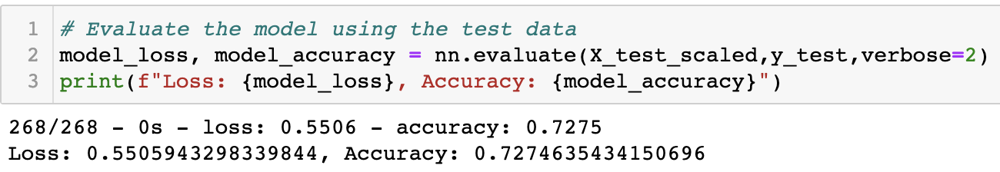
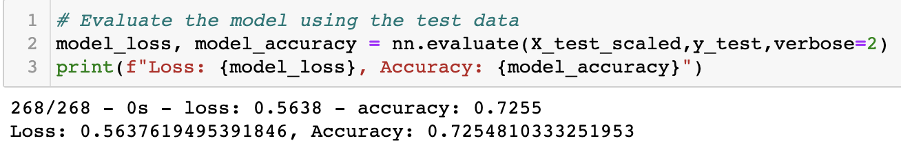
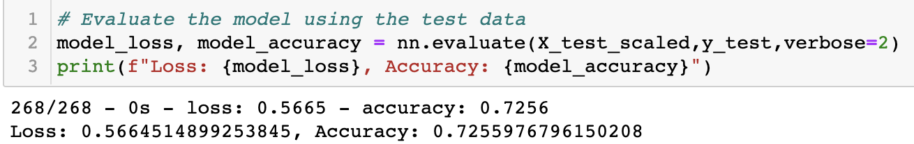

# Neural_Network_Charity_Analysis

## Project Overview 

This project employs Machine Learning and Neural Networks to create a binary classifier that is able to predict whether applicants would be successful if they were funded by the charitable organization “Alphabet Soup”.  Alphabet Soup’s business team has provided me with a CSV containing more than 34,000 organizations that have previously received funding to employ in my analysis.

I approached this dataset using the following steps: 
1.	Preprocessed the data for the neural network 
2.	Compiled, Trained and Evaluated the model 
3.	Optimized the model for greater accuracy 

## Results

### Data Preprocessing
o	The target variable used for this model was the “IS_SUCCESFUL” column.

o	The featured variables used for this model were all columns excluding the “IS_SUCCESFUL” column, and those of which were dropped. 

o	Two variables were neither targets nor features; the “EIN” and “NAME” columns as they provide unnecessary input data. 

### Compiling, Training, and Evaluating the Model
o	My original model contained a total of 2 hidden layers and an output layer; the first hidden layer contained 80 neurons and the second hidden layer contained 30 neurons. For the hidden layers I selected a “relu” activation function, and for the output layer I employed a “sigmoid” activation function. I chose these specific activation functions because they are the most optimal for this model. 

o	The original model was not able to achieve the 75% accuracy target, rather the model maintained an accuracy level of approximately 72%. 

### Optimization 
1. The first step I took to optimize the model to achieve 75% accuracy was checking the input dataset. In doing so, I removed two additional columns “SPECIAL_CONSIDERATIONS” and “STATUS” from the data frame in order to see if it was possibly confusing the model and leading to performance issues. However, the performance metrics remained the same as our original model. 

2. In addition to the removal of the unnecessary columns, I doubled the number of neurons present in both the first and second layer. However, increasing the number of neurons within the hidden layers instead it led to a decrease in the accuracy score, and could’ve led to overfitting.  

3. The last adjustment I made to the model was increasing the number of epochs from 30 to 100, I implemented this change whilst reverting back to the original number of neurons in the hidden layers. I also altered the activation functions in all layers from “relu” to “tanh”- to see if a change in the activation function would increase the accuracy. The result of this alteration was an increase in the accuracy score from the second attempt, but the first optimization still maintained the highest accuracy score. The performance metrics are shown below. 

## Summary 
Overall, the deep learning model was not successful in reaching the accuracy level of 75% even after three attempts to optimize the model; the most successful model was our original model. The model did not respond positively to the removal of unnecessary columns, increased neurons, increased epochs, or changes in the activation functions. As a result, I would recommend using an entirely different model such as a support vector machine (SVM). SVM was more successful when dealing with equally complex data in our practice datasets and as we are currently using binary classification I believe this model would outperform our current model. 
